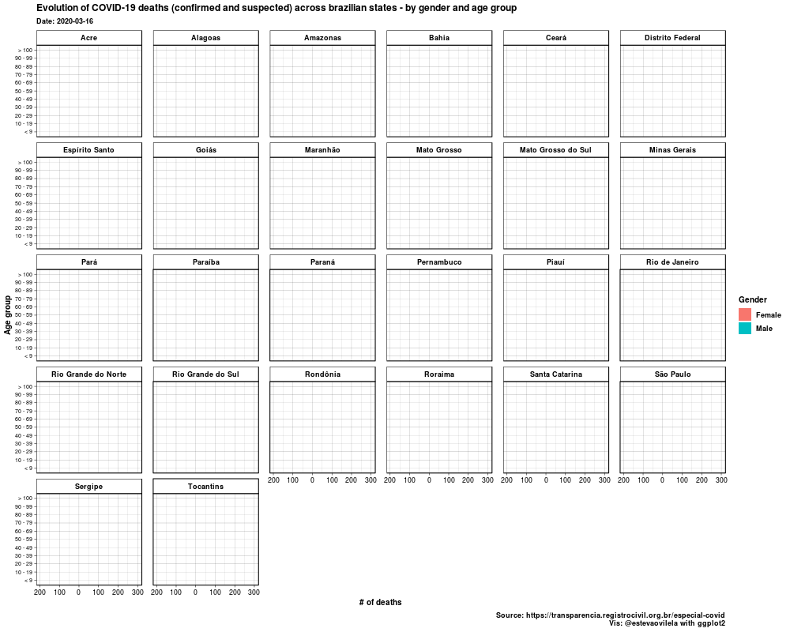

# Covid-19

This project aims to scrap data from ['Portal da transparência - Registro Civil'](https://transparencia.registrocivil.org.br/especial-covid) in the matter of the COVID-19 epidemic, motivated by the lack of data disaggregated by gender and age pointed out by Bernardo Queiroz in a [tweet](https://twitter.com/blqueiroz/status/1253090230187548675).

Ministry of Health of Brazil have been [publishing](https://covid.saude.gov.br/) aggregated data.

It's important to point out that we have some differences in the data: for example, in 24/04/2020, by administrative records there were 4,370 deaths by COVID-19 or under suspects in Brazil; instead, data provided by the Ministry of Health
shows 3,670 deaths.

## Project Organization

    ├── LICENSE
    ├── README.md                  <- The top-level README for developers using this project (also know as this file!)
    ├── data
    │   ├── output                 <- Output processed data
    │   ├── treated                <- The cleaned and treated data for analysis
    │   └── raw                    <- The original, immutable data dump
    ├── scripts                    <- R scripts w/ scraping code and some exploratory data analysis
    ├── requirements.txt           <- Packages used in the code

### Prerequisites

We are using R and you need to have the packages on `requirements.txt` installed. To do that, open the terminal and run:

## Authors

* **Estevão Vilela** - *Code maker* - [@estevaovilela](https://github.com/estevaovilela)

## License

This project is licensed under the MIT License - see the [LICENSE.md](LICENSE.md) file for details.

## Acknowledgments

* Thanks to [@fernandascovino](https://github.com/fernandascovino) for sharing:
  * This README was adapted from [*A template to make good README.md*](https://gist.github.com/PurpleBooth/109311bb0361f32d87a2)
  * The structure of this repository was adapted from [*Fast Project Templates*](https://github.com/JoaoCarabetta/project-templates)
